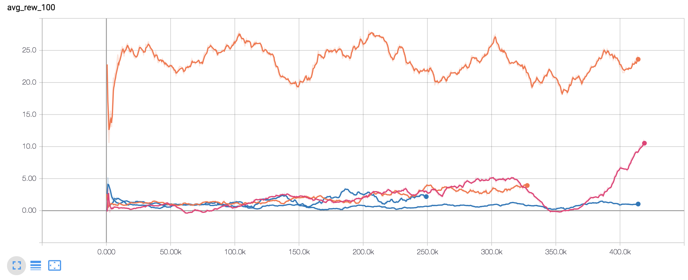

# energypy

energypy supports running reinforcement learning experiments on energy environments.

energypy is built and maintained by Adam Green - [adam.green@adgefficiency.com](adam.green@adgefficiency.com).  

[](https://travis-ci.org/ADGEfficiency/energy-py)

- [introductory blog post](http://www.adgefficiency.com/energypy-reinforcement-learning-for-energy-systems/)
- [DQN debugging](http://adgefficiency.com/dqn-debugging/)
- [DDQN hyperparameter tuning](http://adgefficiency.com/dqn-tuning/)
- [example of low level API - DQN and battery environment](https://github.com/ADGEfficiency/energypy/blob/master/notebooks/examples/DQN_battery_example.ipynb)
- [talk covering two years of lessons working on energypy](https://gitpitch.com/ADGEfficiency/energy-py-talk#/)

## Basic use

The most common access point for a user will be to run an experiment.  The experiment is setup using config files that live in `energypy/experiments/configs`.  An experiment is run by passing the experiment name and run name as arguments

```bash
$ cd energypy/experiments

$ python experiment.py example dqn
```

energypy provides a simple and familiar gym style low-level API for agent and environment initialization and interactions

```python
import energypy

env = energypy.make_env(env_id='battery')

agent = energypy.make_agent(
    agent_id='dqn',
    env=env,
    total_steps=1000000
    )

observation = env.reset()

while not done:
    action = agent.act(observation)
    next_observation, reward, done, info = env.step(action)
    training_info = agent.learn()
    observation = next_observation
```

Results for this run are then available at

``` bash
$ cd energypy/experiments/results/example/dqn

$ ls
agent_args.txt
debug.log
env_args.txt
env_histories
ep_rewards.csv
expt.ini
info.log
runs.ini
```

The progress of an experiment can be watched with TensorBoard

```bash

$ tensorboard --logdir='./energypy/experiments/results'

```

Learning performance of the DQN agent on the flexibility environment across two random seeds.  The red line is a naive benchmark agent.  The reward per episode can be directly interpreted as dollars per day.

Performance of a baseline agent versus two learning agents on the flexibility environment:



## Installation

The main dependencies of energypy are TensorFlow, numpy, pandas and matplotlib.

To install energypy using an Anaconda virtual environment

```bash
$ conda create --name energypy python=3.5.2

$ activate energypy (windows) OR source activate energypy (unix)

$ git clone https://github.com/ADGEfficiency/energypy.git

$ cd energypy

$ python setup.py install

$ pip install --ignore-installed -r requirements.txt

```
### Philosophy

The aim of energypy is to provide 

- high quality implementations of agents suited to solving energy problems
- energy environments based on decarbonization problems
- tools to run experiments

The design philosophies of energypy are

- simplicity
- iterative design
- simple class hierarchy structure (maximum of two levels)
- ideally code will document itself - comments only used when needed
- utilize Python standard library (deques, namedtuples etc) 
- utilize tensorflow & tensorboard
- provide sensible defaults for args

Preference is given to improving and iterating on existing designs over implementing new agents or environments.

energypy was heavily influenced by Open AI [baselines](https://github.com/openai/baselines) and [gym](https://github.com/openai/gym).

### Agents

energypy is currently focused on a high quality implementation of DQN ([ref Mnih et. al (2015)](https://web.stanford.edu/class/psych209/Readings/MnihEtAlHassibis15NatureControlDeepRL.pdf)) and along with naive and heuristic agents for comparison.

DQN was chosen because

- most energy environments have low dimensional action spaces (making discretization tractable).  Discretization still means a loss of action space shape, but the action space dimensionality is reasonable
- highly extensible (DDQN, prioritized experience replay, dueling, n-step returns - see [Rainbow](https://arxiv.org/pdf/1710.02298.pdf) for a summary
- able to learn off policy
- established algorithm, with many implementations on GitHub

Naive agents include an agent that randomly samples the action space, independent of observation.  Heuristic agents are
usually custom built for a specific environment.  Examples of heuristic agents include actions based on the time of day or on the values of a forecast.

### Environments

energypy provides custom built models of energy environments and wraps around Open AI gym.  Support for basic gym
models is included to allow debugging of agents with familiar environments.

Beware that gym deals with random seeds for action spaces in [particular ways](https://github.com/openai/gym/blob/master/gym/spaces/prng.py).  v0 of gym environments [ignore the selected action 25% of the time](http://amid.fish/reproducing-deep-rl) and repeat the previous action (to make environment more stochastic).  v4 can remove this randomness.

**CartPole-v0**

Classic cartpole balancing - [gym](https://github.com/openai/gym/blob/master/gym/envs/classic_control/cartpole.py) - [energypy](https://github.com/ADGEfficiency/energypy/blob/dev/energypy/envs/register.py)

**Pendulum-v0** 

Inverted pendulum swingup - [gym](https://github.com/openai/gym/blob/master/gym/envs/classic_control/pendulum.py) - [energypy](https://github.com/ADGEfficiency/energypy/blob/dev/energypy/envs/register.py)

**MountainCar-v0** 

An exploration problem - [gym](https://github.com/openai/gym/blob/master/gym/envs/classic_control/mountain_car.py) - [energypy](https://github.com/ADGEfficiency/energypy/blob/dev/energypy/envs/register.py)

**Electric battery storage** 

Dispatch of a battery arbitraging wholesale prices - [energypy](https://github.com/openai/gym/blob/master/gym/envs/classic_control/mountain_car.p://github.com/ADGEfficiency/energypy/tree/dev/energypy/envs/battery)

Battery is defined by a capacity and a maximum rate to charge and discharge, with a round trip efficiency applied on storage.

**Demand side flexibility** 

Dispatch of price responsive demand side flexibility - [energypy](https://github.com/ADGEfficiency/energypy/tree/dev/energypy/envs/flex)

Flexible asset is a chiller system, with an action space of the return temperature setpoint.  An increased setpoint will
reduce demand, decreased will increase demand.
