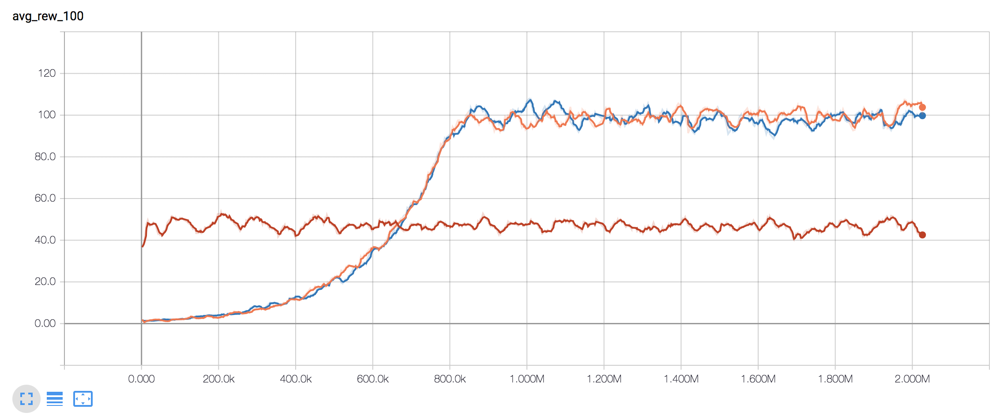

# energy_py

energy_py supports reinforcement learning for energy systems.  This library provides agents and environments, as well as tools to run experiments. 

energy_py is built and maintained by Adam Green - [adam.green@adgefficiency.com](adam.green@adgefficiency.com).  
- [introductory blog post](http://adgefficiency.com/energy_py-reinforcement-learning-for-energy-systems/)
- [DQN debugging](http://adgefficiency.com/dqn-debugging/)
- [DDQN hyperparameter tuning](http://adgefficiency.com/dqn-tuning/)
- [introductory Jupyter notebook](https://github.com/ADGEfficiency/energy_py/blob/master/notebooks/examples/Q_learning_battery.ipynb)

## Basic usage

energy_py provides a simple and familiar low-level API for agent and environment initialization and interactions

```python
import energy_py

env = energy_py.make_env(env_id='battery')

agent = energy_py.make_agent(
    agent_id='dqn',
    env=env,
    total_steps=1000000
    )

observation = env.reset()

while not done:
    action = agent.act(observation)
    next_observation, reward, done, info = env.step(action)
    training_info = agent.learn()
    observation = next_observation
```

The most common access point for a user will be to run an experiment.  An experiment is run by passing the experiment name and run name as arguments

```bash

$ cd energy_py/experiments

$ python experiment.py example dqn
```

Results for this run are then available at

``` bash
$ cd energy_py/experiments/results/example/dqn

$ ls
agent_args.txt
debug.log
env_args.txt
env_histories
ep_rewards.csv
expt.ini
info.log
runs.ini
```

The progress of an experiment can be watched with TensorBoard

```bash

$ tensorboard --logdir='./energy_py/experiments/results'

```



## Installation

The main dependencies of energy_py are TensorFlow, numpy, pandas and matplotlib.

To install energy_py using an Anaconda virtual environment

```bash
$ conda create --name energy_py python=3.5.2

$ activate energy_py (windows) OR source activate energy_py (unix)

$ git clone https://github.com/ADGEfficiency/energy_py.git

$ cd energy_py

$ python setup.py install (using package)
or
$ python setup.py develop (developing package)

$ pip install --ignore-installed -r requirements.txt

```
### Project 

The aim of energy_py is to provide 
- high quality implementations of agents suited to solving energy problems
- mutiple energy environments
- tools to run experiments

The design philosophies of energy_py
- simplicity
- iterative design
- simple class heirarchy structure (maximum of two levels)
- utilize Python standard library (deques, namedtuples etc) 
- utilize TensorFlow & TensorBoard
- provide sensible defaults for args

energy_py was heavily infulenced by Open AI [baselines](https://github.com/openai/baselines) and [gym](https://github.com/openai/gym).

### Agents

energy_py is currently focused on a high quality impelementation of DQN and along with naive and heuristic agents for comparison.

DQN was chosen because:
- it is an established algorithm,
- many examples of DQN implementations on GitHub,
- highly extensible (DDQN, prioritized experience replay, dueling, n-step returns - see [Rainbow](https://arxiv.org/pdf/1710.02298.pdf) for a summary
- most energy environments have low dimensional action spaces (making discretization tractable).  Discretization still means a loss of action space shape, but the action space dimensionality is reasonable.
- ability to learn off policy

Naive agents include an agent that randomly samples the action space, independent of observation.  Heuristic agents are
usually custom built for a specific environment.  Examples of heuristic agents include actions based on the time of day or on the values of a forecast.

energy_py provides custom built models of energy environments and wraps around Open AI gym.  Support for basic gym
models is included to allow debugging of agents with familiar environments.

### gym environments

Beware that gym deals with random seeds for action spaces in [particuar
ways](https://github.com/openai/gym/blob/master/gym/spaces/prng.py).  v0 of gym environments [ignore the selected action
25% of the time](http://amid.fish/reproducing-deep-rl) and repeat the previous action (to make environment more stochastic).  v4 can remove this randomness.

**CartPole-v0**

Classic cartpole balancing - [gym](https://github.com/openai/gym/blob/master/gym/envs/classic_control/cartpole.py) - [energy_py](https://github.com/ADGEfficiency/energy_py/blob/dev/energy_py/envs/register.py)

**Pendulum-v0** 

Inverted pendulum swingup - [gym](https://github.com/openai/gym/blob/master/gym/envs/classic_control/pendulum.py) - [energy_py](https://github.com/ADGEfficiency/energy_py/blob/dev/energy_py/envs/register.py)

**MountainCar-v0** 

An exploration problem - [gym](https://github.com/openai/gym/blob/master/gym/envs/classic_control/mountain_car.py) - [energy_py](https://github.com/ADGEfficiency/energy_py/blob/dev/energy_py/envs/register.py)

**electric battery storage** 

Dispatch of a battery arbitraging wholesale prices - [energy_py](https://github.com/openai/gym/blob/master/gym/envs/classic_control/mountain_car.p://github.com/ADGEfficiency/energy_py/tree/dev/energy_py/envs/battery)

Battery is defined by a capacity and a maximum rate to charge and discharge, with a round trip efficieny applied on storage.

**demand side flexibility** 

Dispatch of price responsive demand side flexibility - [energy_py](https://github.com/ADGEfficiency/energy_py/tree/dev/energy_py/envs/flex)

Flexible assset is a chiller system, with an action space of the return temperature setpoint.
